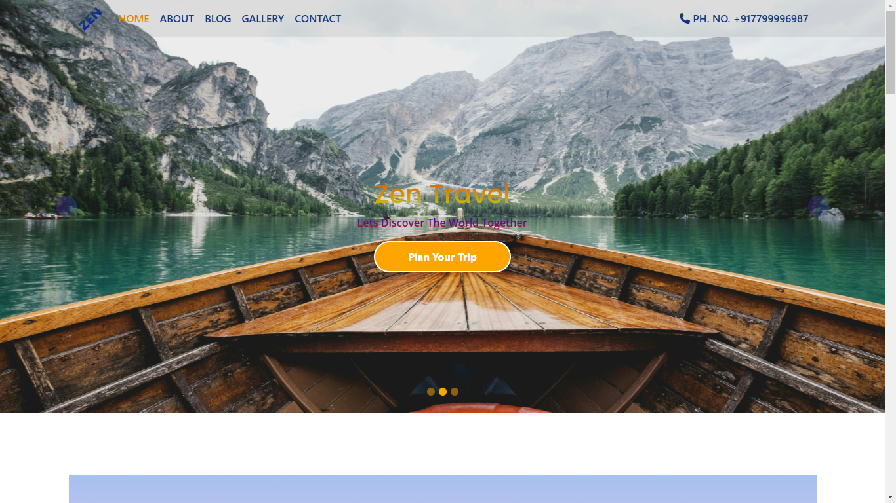

# Project - Zen Travel

This is Travel website. Made using HTML, CSS, Bootstrap. Totally Responsive design.

## Table of contents

- [Overview](#overview)
  - [The challenge](#the-challenge)
  - [Screenshot](#screenshot)
  - [Links](#links)
- [My process](#my-process)
  - [Built with](#built-with)
  - [What I learned](#what-i-learned)
  - [Continued development](#continued-development)
- [Author](#author)

## Overview

### The challenge

Making the Travel website from .psd design file and making it responsive for smaller screens.

### Screenshot

### Links

- Solution URL: [https://github.com/webdevsuman/zen-travels](https://github.com/webdevsuman/zen-travels)
- Live Site URL: [https://webdevsuman.github.io/zen-travels](https://webdevsuman.github.io/zen-travels)

## My process

Step 1 - I first made the structure of the website by using HTML and taking the necessary components from Bootstrap 5.
Step 2 - I edited the contents, importing the images, svg fontawsome icons etc.
Step 3 - Made custom layouts, like using grid or flexbox.
Step 4 - Made the whole website responsive using Media query and flexbox.
Step 5 - Added the fonts, animations, hover effects etc.
Step 6 - Navigation to sub-pages and hyperlinks to sub-sections added.
Step 7 - Readme file created and Github files updated.

### Built with

- Semantic HTML5 markup
- CSS custom properties
- Flexbox
- CSS Grid
- Bootstrap grid, Carousel, Jumbotron
- Open source Animation
- Media query
- fontawesome icons
- favicon
- google fonts
- google map
- Animate.css

### What I learned

This project has been a challenge. I have learned a lot of things. Like -

- Carousel as background,

- Modifying Bootstrap carousel or other bootstrap components,

- CSS grid system to make any desired layout. Even using Grid inside Flexbox and Flexbox inside Grid, like what I have done in the Blog section.

- Applying Bootstrap javascript "data-bs-ride" to modify carousel functions.

- Making google map responsive to the screen size etc.

- Gradient text styling and gradient background etc.

### Continued development

Give feedbacks. I am eager to learn and improve my Album section hover effects of this website.

## Author

- Website - [Suman Das](https://github.com/webdevsuman/)
